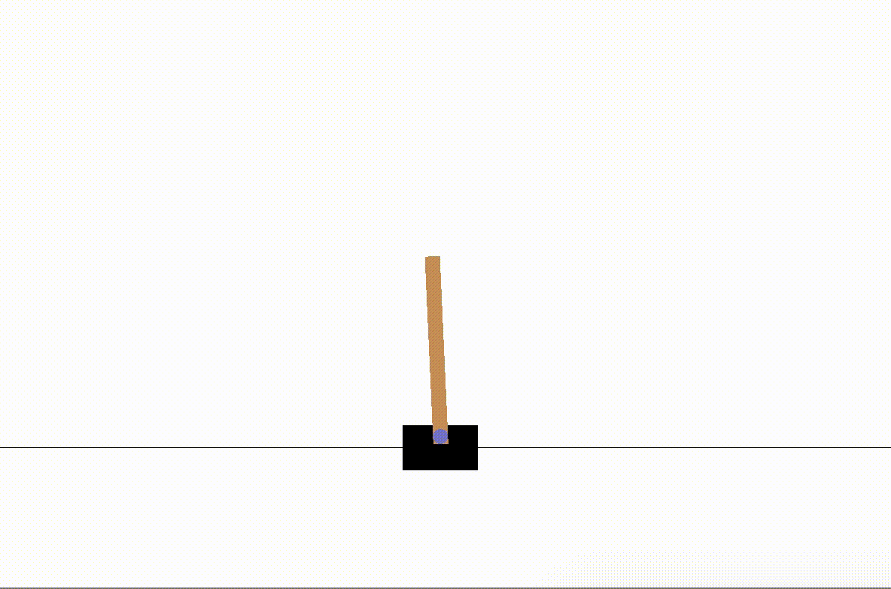

# explore-rl
An exploration of reinforcement learning. The first addressed problem is preventing a pole from falling over from a cart 
that is moving on a frictionless surface.

### Net architecture
1. Dense layer
    - input: 4
    - output: 24
    - activation: Relu
1. Dense layer
    - input: 24
    - output: 24
    - activation: Relu
1. Dense layer
    - input: 24
    - output: 24
    - activation: Relu
1. Dense layer
    - input: 24
    - output: 2
    - activation: linear

#### References
- [Q-learning](https://en.wikipedia.org/wiki/Q-learning)
- [CartPole v0](https://github.com/openai/gym/wiki/CartPole-v0)
- [gsurma's solution](https://github.com/gsurma/cartpole/blob/master/cartpole.py)